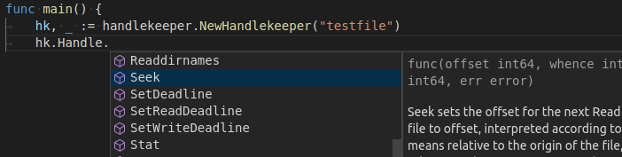

# handlekeeper


[](https://pkg.go.dev/github.com/danielb42/handlekeeper)
[](https://goreportcard.com/report/github.com/danielb42/handlekeeper)
[](https://opensource.org/licenses/MIT)

`handlekeeper` is a wrapper for `os.OpenFile()`. It intends to help applications with keeping track of active textfiles by presenting stable file handles even when the opened files are moved away or deleted. This is achieved by instantly creating a new, empty file in the location of the original file, and re-opening the corresponding filehandle internally.

## Usage

```go
hk, _ := handlekeeper.NewHandlekeeper("/some/file.txt")
```

Now, `hk.Handle` is an ordinary `*os.File` and can be used as usual:



## Note

The handle only stays stable over delete (or move-away) events on the handled file. Truncating the file (as in logrotate's copy-truncate for example) will still break the handle.
